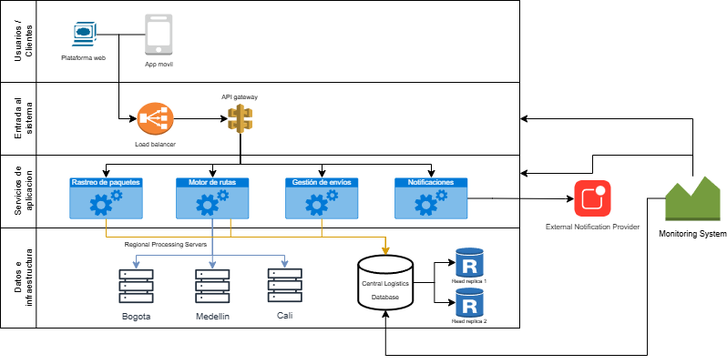

# 🗒️ Registro de Trabajo en Clase - Taller 4

## 📆 Fecha de la sesión
_7 de marzo de 2026_

## 👥 Integrantes presentes
- Bryam Diaz
- Jose Guzman
- Juan Abril

## 🧠 Actividades realizadas en clase

Describa brevemente qué se hizo durante la sesión:

- ¿Qué se discutió con el equipo?

Durante la sesión de trabajo, analizamos el caso de la plataforma logística RedExpress con el objetivo de identificar los principales componentes de su infraestructura tecnológica y comprender cómo interactúan entre sí para soportar las operaciones del sistema. Se discutió cómo fluye la información desde los usuarios que utilizan la aplicación móvil y la plataforma web hasta los servicios backend y la base de datos centralizada.

- ¿Qué decisiones de modelado se tomaron?

A partir de esta discusión, se tomaron decisiones de modelado orientadas a representar la arquitectura en capas. Se definieron cuatro niveles principales: usuarios o clientes, entrada al sistema, servicios de aplicación y capa de datos e infraestructura. Dentro de estas capas se incluyeron componentes como el load balancer, API Gateway, servicios de rastreo de paquetes, motor de rutas, gestión de envíos, notificaciones, servidores regionales de procesamiento y la base de datos central con réplicas de lectura. También se incorporaron elementos externos como el proveedor de notificaciones y el sistema de monitoreo, con el fin de reflejar una infraestructura más completa y cercana a un entorno real.

- ¿Qué herramientas se usaron (papel, pizarra, draw.io, Astah)?

Para la construcción del mapa de infraestructura se utilizó la herramienta draw.io, la cual permitió organizar visualmente los componentes y sus conexiones. Inicialmente se discutieron las ideas en equipo y luego se procedió a plasmar el modelo directamente en el diagrama digital, estableciendo las relaciones entre los distintos servicios y recursos de infraestructura.

- ¿Qué parte del trabajo se alcanzó a desarrollar?

Durante la sesión se logró desarrollar un mapa preliminar de la infraestructura lógica del sistema, identificando el flujo principal de solicitudes desde los clientes hacia el backend y la base de datos. Asimismo, se comenzaron a detectar posibles áreas críticas del sistema, como la dependencia de la base de datos central, la carga sobre el API Gateway y la necesidad de monitoreo para garantizar disponibilidad y rendimiento. Este avance permitió contar con una primera representación visual de la arquitectura sobre la cual se podrá continuar el análisis técnico en las siguientes etapas del taller.

## 🧭 Lectura técnica del diagrama

### 1) Flujo principal de extremo a extremo

1. Usuario final interactúa desde plataforma web o app móvil.
2. El tráfico entra por el **Load Balancer** para distribuir solicitudes.
3. El **API Gateway** enruta y centraliza el acceso a los servicios.
4. Los servicios de aplicación procesan la lógica de negocio:
	- Rastreo de paquetes
	- Motor de rutas
	- Gestión de envíos
	- Notificaciones
5. Los servicios consultan/escriben sobre la **base de datos central**.
6. Se apoyan servidores regionales (Bogotá, Medellín y Cali) para procesamiento zonal.
7. El envío de notificaciones depende de un proveedor externo.
8. El sistema de monitoreo recibe eventos para observabilidad y alertamiento.

### 2) Decisiones de modelado y justificación

- **Arquitectura por capas:** facilita lectura, diagnóstico y separación de responsabilidades.
- **Servicios desacoplados por dominio funcional:** permite aislar cargas y analizar impacto por módulo.
- **Servidores regionales:** representan distribución geográfica del procesamiento y cercanía operativa.
- **Réplicas de lectura en datos:** muestran una estrategia inicial para aliviar consultas intensivas.
- **Componentes externos explícitos (notificaciones/monitoreo):** visibilizan dependencias críticas fuera del núcleo.

## 🧩 Boceto inicial del modelo

## 🔍 Diagnóstico técnico preliminar (caso de clase)

### 1) ¿Dónde está el principal cuello de botella?

El principal cuello de botella está en la **base de datos central**, debido a que concentra:

- transacciones de múltiples servicios,
- consultas de rastreo en tiempo real,
- y sincronización de operaciones de envío/rutas.

Aunque existen réplicas de lectura, la escritura continúa centralizada y puede degradar el rendimiento general bajo picos de demanda.

### 2) ¿Dónde hay riesgo de falla (SPOF)?

Puntos críticos:
- API Gateway
- Base de datos principal
- Motor de rutas

Justificación breve:

- **API Gateway:** si falla, se interrumpe el acceso a todos los servicios backend.
- **Base de datos principal:** una indisponibilidad afecta rastreo, gestión de envíos y consistencia operativa.
- **Motor de rutas:** impacta la asignación óptima y la eficiencia logística en toda la red.

### 3) ¿Dónde puede presentarse latencia?

- **Rastreo de paquetes → Base de datos central:** por alta frecuencia de consultas en tiempo real.
- **Servicios regionales → núcleo central:** por saltos de red interzona y congestión en horas pico.
- **Notificaciones → proveedor externo:** por dependencia de SLA y tiempos de respuesta de terceros.

### 4) Impactos operativos observables

- Aumento del tiempo de actualización del estado del paquete.
- Respuestas lentas o intermitentes en app móvil y plataforma web.
- Retraso en notificaciones al cliente final.
- Menor capacidad de escalar horizontalmente si persiste alta dependencia del nodo de datos central.

### 5) Oportunidades de mejora identificadas en clase

- Fortalecer alta disponibilidad del API Gateway (redundancia activa-activa o activa-pasiva).
- Evolucionar la estrategia de datos (particionamiento por zona o replicación multi-región).
- Incorporar caché para consultas frecuentes de rastreo.
- Implementar colas/eventos para desacoplar procesos no críticos en tiempo real.
- Definir umbrales de alerta de latencia, errores y saturación por servicio.

## ✅ Cierre de la sesión de clase

En esta sesión se obtuvo un diagnóstico preliminar del caso RedExpress con base en el diagrama de infraestructura. El resultado permite justificar técnicamente los puntos críticos de rendimiento y disponibilidad, y deja una base sólida para la retroalimentación docente del taller en clase.

_Este documento resume el trabajo colaborativo realizado durante la sesión del taller 4 en el curso AREM - Universidad de La Sabana._
